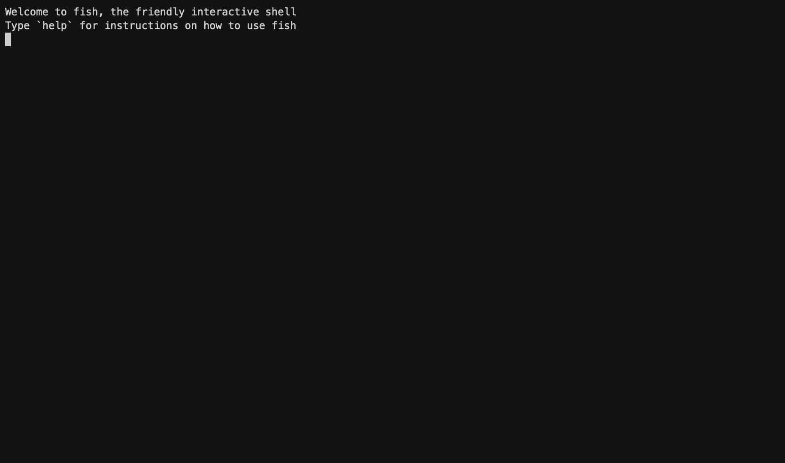

# Extend API autogenerated client in Ruby
[](https://badge.fury.io/rb/helloextend_api_client)
[](https://circleci.com/gh/dpritchett/helloextend-ruby-client)



## HOWTO

* Register for an Extend merchant demo account at https://demo.merchants.extend.com/login

* Copy your Extend sandbox credentials from https://demo.merchants.extend.com/dashboard/settings into environment variables:
```bash
# from https://demo.merchants.extend.com/dashboard/settings

export EXTEND_STORE_ID="my-store-id
export EXTEND_API_KEY="my-api-key"
```

* (OPTIONAL — I [checked in a copy already](./reference/openapi_spec.json)) Find the current swagger source from extend's site. This part was hard — they don't explicitly publish it!

* Download that source as `./reference/openapi_spec.json`

* Generate a new ruby client from that spec: `make build-ruby-client` (uses a docker image to generate ruby bindings from the JSON file)

* Build and install the resulting ruby gem:
```console
> make install-gem
cd ./clients/ruby && \
	gem build openapi_client.gemspec && \
	gem install ./openapi_client-1.0.0.gem
  Successfully built RubyGem
  Name: openapi_client
  Version: 1.0.0
  File: openapi_client-1.0.0.gem
Successfully installed openapi_client-1.0.0
Parsing documentation for openapi_client-1.0.0
Installing ri documentation for openapi_client-1.0.0
Done installing documentation for openapi_client after 1 seconds
1 gem installed
```

* Execute [the test client](./test_client.rb) to create a new product for your store via the demo(sandbox) API:

```console
> ruby ./test_client.rb
{:brand=>"ACME Brand", :createdAt=>1587580830481.0, :enabled=>false, :title=>"Product title", :updatedAt=>1587580830481.0, :referenceId=>"2895", :plans=>[]}
#<OpenapiClient::Product:0x00007f9ea5951348
 @brand="ACME Brand",
 @created_at=1587580830481.0,
 @enabled=false,
 @plans=[],
 @reference_id="2895",
 @title="Product title",
 @updated_at=1587580830481.0>
```
